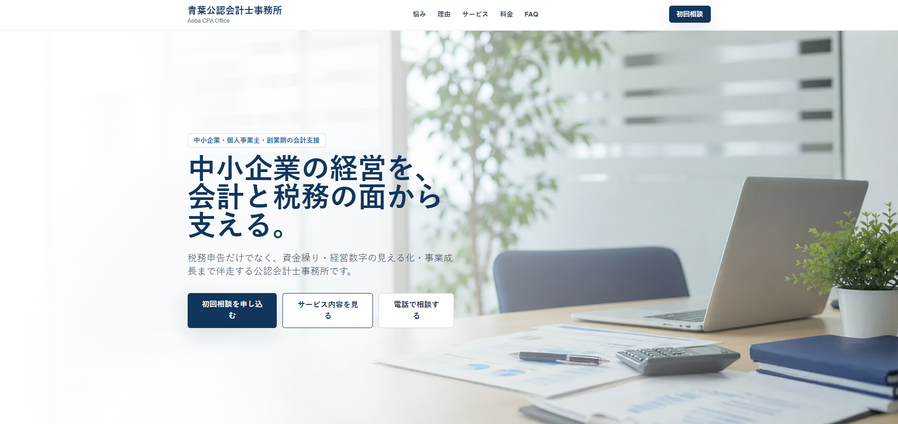
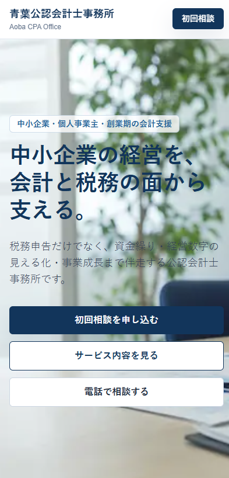

# 青葉公認会計士事務所 LP

公認会計士・税理士事務所向けのランディングページ制作サンプルです。  
クラウドワークス応募用ポートフォリオとして制作しました。  
中小企業・個人事業主・スタートアップへの初回相談獲得を目的とした構成です。

---

## Demo

https://accounting-firm-lp.vercel.app/

---

## スクリーンショット

| PC ファーストビュー | スマホ ファーストビュー |
|---|---|
|  |  |

---

## 制作のポイント

### 1. 士業向けの信頼感を重視したデザイン

ネイビーを基調としたオリジナルカラーパレットを定義し、サイト全体で統一しました。誠実さと専門性が伝わる配色を意識し、公認会計士事務所らしい落ち着いた印象を目指しています。

### 2. PC・スマートフォンの両方で見やすい構成

背景画像の上に透過レイヤーとグラデーションを重ねることで、画面サイズに関係なくテキストの可読性を確保しています。スマートフォンでもストレスなく閲覧できるよう調整しました。

### 3. 問い合わせにつながる導線設計

「初回相談」「電話相談」「サービス内容確認」の3つの導線をヘッダー・ヒーロー・フッターに配置し、利用者が迷わず行動できる構成にしています。

### 4. 信頼性を高める情報設計

実績数値や3ステップの導入フローを追加し、初めて相談する方でも利用開始までの流れをイメージしやすい構成にしました。

### 5. 競合分析を取り入れた改善

GitHub MCPとLazywebを活用し、競合LPを分析しながら改善を繰り返しました。デザインだけでなく、問い合わせ導線や情報設計も意識して制作しています。

---

## Tech Stack

| カテゴリ | 技術 |
|---|---|
| フレームワーク | Next.js 15 (App Router) |
| 言語 | TypeScript |
| スタイリング | Tailwind CSS v3 |
| デプロイ | Vercel |

---

## Setup

```bash
# 依存パッケージのインストール
npm install

# 開発サーバーの起動
npm run dev
```

ブラウザで `http://localhost:3000` を開いて確認できます。

```bash
# 型チェック
npm run typecheck

# ビルド確認
npm run build
```

---

## 注意事項

- 本リポジトリはポートフォリオ用のサンプルです。「青葉公認会計士事務所」は架空の事務所名です。
- ヒーロー画像は `public/images/aoba-office-hero.png` を参照しています。商用利用時は自事務所の写真に差し替えてください。
- 電話番号・メールアドレス・住所はサンプル値です。実際に公開する場合は必ず差し替えてください。
- 料金表はあくまでサンプルです。実際の業務量・面談頻度に応じて変更してください。
- お客様の声はサンプルテキストです。実際の口コミを掲載する場合は掲載許可を確認してください。
